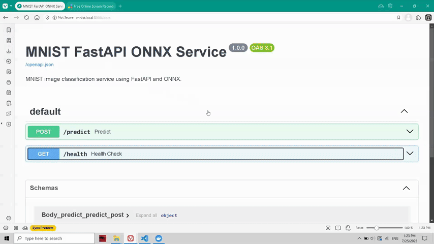

# ⚡ Ultra-Fast Image Inference API with FastAPI + ONNX + Kubernetes


[](https://opensource.org/licenses/MIT)
[](https://github.com/CristianLazoQuispe/ML-Mnist-kubernetes)


A blazing fast image classification API built with FastAPI + ONNX for high-performance inference, deployed in Kubernetes with auto-scaling, unit tests, and a hexagonal architecture.

---

## 🚀 Features

- 🧠 ONNX Runtime (no heavy PyTorch runtime)
- ⚡ FastAPI with automatic `/docs` and `/predict` endpoint
- 🌐 Exposed via **Ingress** with custom domain (`mnist.local`)
- 📦 Dockerized, ready for Kubernetes
- 🔁 Auto-scalable via **HPA** + metrics-server
- 🧪 Unit tested with Pytest, CI-ready
- 🧱 Hexagonal architecture (Adapters, Core, Domain, API)
- 📸 Accepts `multipart/form-data` image uploads

---

## 🧬 Architecture

```
Client → Ingress → FastAPI → ONNX Inference (inside container)
↑                          ↓
Test Job ← Unit Tests ← Hexagonal Core (adapter, domain)
```

---

## 🗂️ Project Structure

```

.
├── app/                # Main FastAPI + adapter layers
├── core/               # Domain and service logic (hexagonal)
├── assets/             # ONNX model and test images
├── docker/             # Dockerfiles for API and tester
├── k8s/                # Kubernetes YAMLs: deployment, service, ingress, jobs
├── tests/              # Pytest-based unit tests
├── Makefile            # Fast deployment, test and load generation
└── README.md

````

---

## 🔧 Setup (Local)

```bash
git clone https://github.com/tu_usuario/ml-mnist-kubernetes
cd ml-mnist-kubernetes
make build push deploy
make test        # Run unit test in-cluster
make open-api    # Open Swagger UI via Ingress
````

---

## 🌐 Try It (After Tunnel)

```bash
# 1. Start tunnel
minikube tunnel

# 2. Visit API
http://mnist.local/docs
```

---

## 🧪 Run Load Test

```bash
make load         # 2000 requests
make load-thread  # 2000 parallel requests
kubectl top pods
kubectl get hpa
```

---

## 🧠 Predict Programmatically

```python
import requests
files = {"file": open("assets/test_images/mnist_03.png", "rb")}
r = requests.post("http://mnist.local:8000/predict", files=files)
print(r.json())
```

---

## 🧹 Clean

```bash
make clean
```

---

## 📄 License

MIT © Cristian — 2025

---

## 🙌 Contributing

Pull requests are welcome. If you find value in this repo, feel free to ⭐ it or share it!

---

## ✨ Screenshot (Swagger UI)

<!-- Replace with your screenshot -->



````
